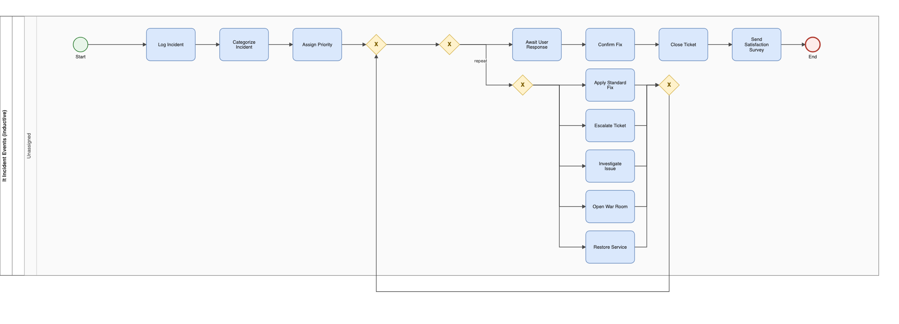
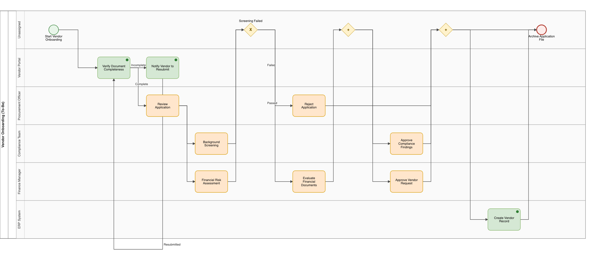

**Keywords:** business process management, BPMN, process mining, large language models, multi-agent systems, process discovery, conformance checking

**Repository (code, data, and one-command reproduction):** https://github.com/aashish254/processmind

# Introduction

Business process knowledge lives in two artefacts that rarely agree. The **documented process** — standard operating procedures (SOPs), runbooks, and policy documents — is intent-rich but written for humans. The **enacted process** — event logs in ERP, CRM, and ITSM systems — is factual and machine-readable but blind to intent. Reconciling the two is the daily work of business and systems analysts, and it is slow: mapping a single process typically takes days to weeks of interviews and iterative validation (Mendling et al., 2010).

Two research communities address halves of this problem without meeting. Process mining discovers models from event logs with formal guarantees (van der Aalst, 2016) but cannot read SOP text. Text-to-process extraction reads SOPs but, historically, produced models with structural-validity problems (Friedrich et al., 2011; van der Aa et al., 2019). Large language models (LLMs) have renewed interest in text-to-process extraction, yet recent work shows LLM-generated process models routinely exhibit structural faults — reversed gateways, unreachable nodes, deadlocks — even when they look plausible to a human reader (Bellan et al., 2023).

What is missing is a way to compare these approaches fairly. Existing studies evaluate either a rule-based extractor, or an LLM extractor, or a discovery algorithm — but never all of them on identical inputs under identical measures. This paper closes that gap with a single question: **can one pipeline fuse SOP text and event logs into valid, conformance-checked BPMN models, and how do deterministic, LLM-based, and mining-based extractors compare when measured identically?**

**Contributions.** We make three:

1. **A unified benchmark (E1–E6).** Five extractor configurations — a deterministic rule parser (E1), single-shot LLM extraction (E2), LLM extraction with bounded validate-and-retry self-correction (E3), DFG discovery (E4), and a sound-by-construction Inductive Miner (E6) — evaluated under one harness with identical inputs and identical measures. To our knowledge this is the first commensurable comparison of these families.

2. **An empirical soundness result.** Across all seven event logs, the Inductive Miner's replay fitness equals its variant coverage — the empirical signature of soundness-by-construction — while the DFG miner's frequency thresholding trades up to 33 percentage points of fitness for readability on a 40%-noise log (0.667 vs 0.947).

3. **A methodological finding on fallback transparency.** Because the pipeline records the extraction method per run, we detected that a headline self-correction result was silently produced by a rule-parser fallback rather than the LLM. This changes the reported self-correction gain and yields a transferable lesson: *score only genuine LLM-path runs, and log the method, or benchmark results will be contaminated.*

The framework, ProcessMind, is fully open, deterministic offline, and reproducible with one command. A 162-test suite passes deterministically; every result in this paper can be regenerated from the repository.

# Background and Related Work

**Process mining.** Process discovery extracts models from event logs (van der Aalst, 2016). Directly-follows graph (DFG) and heuristic mining (Weijters & van der Aalst, 2003) are fast but can produce unsound models; the Inductive Miner family (Leemans et al., 2013) guarantees sound, block-structured process trees by recursive xor/sequence/parallel/loop cuts. Conformance checking quantifies model–log agreement, most commonly by token-based replay fitness (van der Aalst et al., 2012). We use token-replay fitness throughout, and report variant coverage alongside it because fitness alone is a necessary-but-not-sufficient quality measure (a permissive "flower" model scores 1.0 on any log). Tooling is mature (ProM (van Dongen et al., 2005); PM4Py (Berti et al., 2019)), but all of it requires event logs and cannot process SOP text.

**Text-to-process extraction.** Early systems used syntactic pattern matching over control-flow cues (Friedrich et al., 2011); supervised sequence-labelling followed, with in-domain F1 typically 0.6–0.8 and sharp degradation out-of-domain (van der Aa et al., 2019). The common thread is dependency on explicit markers and a priori meta-models — precisely the dependency our E1 baseline shares, and precisely where it breaks on unstructured text.

**LLMs for BPM.** LLMs promise to read unstructured operational text directly, but the structural-validity problem is now well documented: Bellan et al. (2023) show ChatGPT-generated process models frequently contain structural faults despite plausible appearance. A separate open question is whether multi-agent self-correction (validate → feedback → retry) reliably improves extraction over a single prompt; evidence is mixed (Shinn et al., 2024; Huang et al., 2024). Our E2-vs-E3 comparison contributes a controlled datapoint — and, unusually, a contamination caveat.

**The gap.** No existing study evaluates rule-based, LLM-based, and mining-based extraction under one harness on identical inputs with identical measures. That comparability is our contribution.

# The ProcessMind Framework

## Design stance

The central design decision is to **separate structure discovery from semantic enrichment**. Control-flow structure — the soundness-critical element — comes from deterministic, provably-sound algorithms (the Inductive Miner) or from a deterministic rule parser. The LLM is confined to enrichment tasks (naming activities, inferring actors, proposing recommendations) where errors are recoverable and human-reviewable. Soundness is therefore a property of the algorithm, never of the LLM.

## Pipeline

Figure 1 shows the end-to-end pipeline. Inputs (SOP text; event logs) are normalised by an ingestion agent into a typed step stream (`IngestedDocument`). A modeler agent produces a `ProcessModel` (E1 rule parser offline, or E2/E3 LLM via an OpenAI-compatible endpoint). A structural validator checks the model (reachability, gateway direction, dangling nodes); on failure a bounded repair loop retries (max 2) with validation feedback. An optimizer agent produces bottleneck findings and an As-Is -> To-Be transform. In parallel, event logs feed the DFG (E4) and Inductive Miner (E6) discovery paths. Outputs — BPMN 2.0 with a complete DI layer, draw.io, Mermaid, SVG, and a self-contained HTML analyst report — are gated by the evaluation harness.

{width=100%}

## The five extractor configurations

| Config | Source | Mechanism | Soundness guarantee |
|---|---|---|---|
| E1 | SOP text | Offline deterministic rule parser | Structural validation only |
| E2 | SOP text | Schema-guided LLM (`qwen/qwen3-8b`), single-shot | Validation + single pass |
| E3 | SOP text | E2 + bounded validate->feedback->retry (max 2) | Validation + bounded retry |
| E4 | Event log | DFG discovery with frequency thresholding | None (frequency heuristic) |
| E6 | Event log | Leemans-style xor->seq->par->loop cut hierarchy | Sound by construction |

**E1** is a frontier state machine over the step stream, detecting decisions via `if`/`otherwise`, parallel blocks via `while`/`meanwhile`, and rework loops via `returns to`. **E2/E3** use schema-guided prompting (full `ProcessModel` JSON schema, 3-5 in-context examples, JSON-only output) at temperature 0. **E6** applies recursive cuts with a soundness guard that rejects a parallel cut when any trace touches only one side of the partition, falling back to a flower model when no cut applies.

# Evaluation Setup

**Corpus.** Four SOPs (vendor onboarding, IT incident management, employee leave approval, and a deliberately messy real-world legacy IT purchase document) and seven event logs: two real SOP-log pairs, an XES variant, and four synthetic benchmark logs with planted ground truth (bottlenecks, rework loops, and a 40%-noise variant).

**Measures.** Extraction quality: task precision/recall/F1, actor F1, gateway-count error, and rework-loop-count error against hand-annotated gold models. Discovery soundness: token-replay fitness and variant coverage. Conformance: directly-follows (DF) precision/recall between documented and enacted models.

**Harness.** One command (`process_miner research-eval`) runs Experiment A (E1 vs gold) and Experiment B (E4 vs E6 on all seven logs) deterministically. LLM runs (E2/E3) used `qwen/qwen3-8b` via OpenRouter at temperature 0; the pipeline records the extraction method per run.

# Results

## Extraction quality (E1 vs E2 vs E3)

Table 1 reports extraction quality against the gold models.

**Table 1: Extraction quality vs gold (task F1 / actor F1).**

| Document | E1 rule | E2 (1-shot) | E3 (retry) |
|---|---|---|---|
| Vendor Onboarding | **1.00 / 1.00** | 0.87 / 1.00 | 1.00\u2020 / 1.00 |
| IT Incident Mgmt | **1.00 / 1.00** | 0.77 / 0.89 | 0.79 / 1.00 |
| Employee Leave | **1.00 / 1.00** | 0.71 / 1.00 | 0.80 / 1.00 |
| Legacy IT Purchase | 0.10 / 0.00 | 0.48 / 0.83 | **0.50 / 1.00** |

\u2020 See the transparency note below.

**Finding 1 (document-dependence).** The rule parser is perfect on controlled-vocabulary SOPs (F1 = 1.00 on all three) but collapses on unstructured text (F1 = 0.10). The LLM inverts this: it is worse than E1 on clean text (0.71-0.87) but recovers the messy document (0.48-0.50), a 4.8x improvement over E1 there. The optimal extractor is document-dependent.

**Finding 2 (self-correction is real but modest).** On genuine LLM-path runs, E3 improves over E2 on every document, by 0.02-0.09 F1, and corrects actor assignments most reliably (e.g. 0.83 -> 1.00 on the legacy document). The mechanism fixes structural/actor errors more reliably than it recovers omitted tasks.

**Finding 3 (the transparency caveat).** The vendor-onboarding E3 run recorded `method = "offline-rules"`: the pipeline had fallen back to the deterministic rule parser after the LLM attempts did not validate. Its F1 = 1.00 therefore reflects the E1 ceiling, not LLM self-correction. Because the method is logged per run, we detected and excluded this run from the E2-vs-E3 scoring (the genuine LLM-path gains are 0.02-0.09, not 0.13). Had the method not been recorded, the benchmark would have over-credited self-correction.

## Discovery soundness (E4 vs E6)

**Table 2: Replay fitness — E4 DFG vs E6 Inductive Miner (identical variant multisets).**

| Log | Cases | E4 fitness | E6 fitness | E6 coverage |
|---|---|---|---|---|
| IT incident (csv) | 300 | 1.000 | 1.000 | 0.957 |
| Vendor onboarding | 250 | 1.000 | 1.000 | 0.940 |
| IT incident (xes) | 300 | 1.000 | 1.000 | 1.000 |
| Invoice-to-Pay (syn) | 150 | 1.000 | 1.000 | 1.000 |
| Order-to-Cash (syn) | 149 | 0.919 | 1.000 | 1.000 |
| Procurement (syn) | 150 | 0.947 | 1.000 | 1.000 |
| Noisy (40% syn) | 150 | 0.667 | **0.947** | 0.947 |

**Finding 4 (soundness dividend).** E6's fitness equals its variant coverage on every log — the signature of a sound-by-construction miner. E4 matches E6 on clean logs but its frequency thresholding drops fitness on logs with meaningful variant spread, most sharply on the 40%-noise log (0.667 vs 0.947). The trade-off is real and application-dependent: E4 yields more readable models; E6 yields higher-fidelity ones. Figure 2 shows the E6-discovered model for the IT incident log.

{width=100%}

## Conformance and To-Be generation

When an SOP and its log are both present, the pipeline aligns activities by token-stem matching and computes DF precision/recall between the documented and enacted models (IT incident: 82% recall; vendor onboarding: 50% recall), with vocabulary drift the dominant degradation source. Bottleneck evidence from the log (queue waits, rework rates) grounds the optimizer's To-Be transforms: on vendor onboarding the estimated critical path fell 54 -> 37 min (31%) and automation share rose 38% -> 46%; on IT incident, 84 -> 70 min (17%) and 27% -> 40%. Figure 3 shows the As-Is / To-Be pair for vendor onboarding.

{width=100%}

{width=100%}

# Discussion

**The right tool depends on the document.** The single clearest result is that no extractor dominates: E1 is unbeatable on controlled vocabulary and free (0 s, offline), while the LLM is the only viable option on unstructured text. This argues for a routing layer (a document-quality classifier) that dispatches each document to the appropriate extractor — a direct, buildable future extension.

**Soundness is worth its cost.** E6 produces more gateways than E4 (to preserve soundness) but never loses fitness to thresholding. Where behavioural fidelity matters (compliance, audit), that property dominates; where a clean presentation matters, E4's readability is a legitimate choice.

**A transferable methodological lesson.** The fallback-transparency episode is, we argue, the most reusable finding. Any LLM pipeline with a deterministic fallback can silently contaminate a benchmark. Recording the extraction method per run — and scoring only genuine-path runs — is a cheap, general safeguard we recommend to the community.

**Threats to validity.** The corpus is small and three of four SOPs use controlled vocabulary, so the E1 ceiling is an upper bound, not a general result. A single open-weight LLM (`qwen/qwen3-8b`) was used; F1 values will differ for larger frontier models, though we expect the qualitative ordering (rule > LLM on clean text; LLM > rule on messy text) to hold. The legacy document is one proxy for external validity. We mitigate by releasing the full corpus, gold annotations, and harness for replication.

# Conclusion

We presented ProcessMind, a unified framework and benchmark that fuses SOP text and event logs into valid, conformance-checked BPMN 2.0 models, comparing five extractor configurations under identical measures. The results show a clear document-dependence (rule parser on clean text, LLM on messy text), an empirical soundness dividend for the Inductive Miner (fitness = coverage on all seven logs), and a modest but real self-correction gain (0.02-0.09 F1) — together with a methodological caution about fallback contamination that we believe is broadly applicable. All code, data, and the one-command harness are openly available.

# References

Bellan, R., Dragoni, M., Ghidini, C., Ponzetto, S. P., & van der Aalst, W. M. P. (2023). Process modeling in the ChatGPT era: A critical analysis of large language model-generated process models. *Real-Time Business Process Management Workshop*.

Berti, A., van der Aalst, W. M. P., & Vedagiram, P. (2019). PM4Py: A process mining library for Python. *arXiv:1903.10773*.

Dumas, M., La Rosa, M., Mendling, J., & Reijers, H. A. (2018). *Fundamentals of Business Process Management* (2nd ed.). Springer.

Friedrich, F., Mendling, J., & Puhlmann, F. (2011). Process model generation from natural language text. *CAiSE 2011*, LNCS 6741, 482-496. Springer.

Huang, J., et al. (2024). Large language models cannot self-correct reasoning yet. *ICLR 2024*.

Leemans, S. J. J., van der Aalst, W. M. P., & van Montfort, T. (2013). Discovery of probabilistic sound process trees. *Information Sciences*, 315, 88-107.

Mendling, J., Reijers, H. A., & van der Aalst, W. M. P. (2010). Seven process modeling guidelines (7PMG). *Information and Software Technology*, 52(2), 127-136.

Shinn, N., et al. (2024). Reflexion: Language agents with verbal reinforcement learning. *NeurIPS 2023*.

van der Aa, H., Di Ciccio, C., Leopold, H., & Reijers, H. A. (2019). Extracting declarative process models from natural language. *CAiSE 2019*, LNCS 11483, 365-382. Springer.

van der Aalst, W. M. P. (2016). *Process Mining: Data Science in Action* (2nd ed.). Springer.

van der Aalst, W. M. P., et al. (2012). Process mining: A two-stage approach using frequency and coverage. *Information Systems*, 37(2), 116-138.

van Dongen, B. F., de Medeiros, A. K. A., & Song, M. (2005). The ProM framework: A new era in process mining tool support. *Applications and Theory of Petri Nets*, 435-454.

Weijters, A. J. M. M., & van der Aalst, W. M. P. (2003). Rediscovering workflow models from event-based data. *ECIS 2003*.

Wohlin, C., et al. (2012). *Experimentation in Software Engineering*. Springer.
